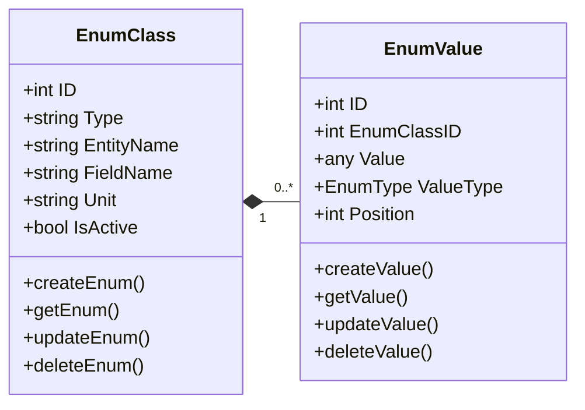

```mermaid
classDiagram
    direction LR

    class EnumClass {
        +int ID
        +string Type
        +string EntityName
        +string FieldName
        +string Unit
        +bool IsActive
        +createEnum()
        +getEnum()
        +updateEnum()
        +deleteEnum()
    }

    class EnumValue {
        +int ID
        +int EnumClassID
        +any Value
        +EnumType ValueType
        +int Position
        +createValue()
        +getValue()
        +updateValue()
        +deleteValue()
    }

    EnumClass "1" *-- "0..*" EnumValue
```