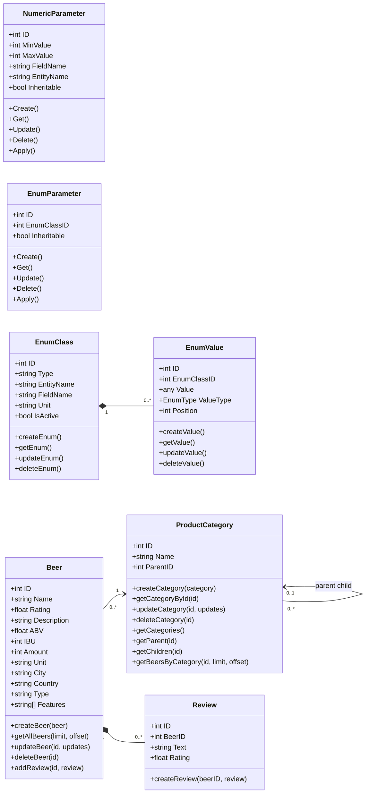

```mermaid
classDiagram
    direction LR

    class NumericParameter {
        +int ID
        +int MinValue
        +int MaxValue
        +string FieldName
        +string EntityName
        +bool Inheritable
        +Create()
        +Get()
        +Update()
        +Delete()
        +Apply()
    }

    class EnumParameter {
        +int ID
        +int EnumClassID
        +bool Inheritable
        +Create()
        +Get()
        +Update()
        +Delete()
        +Apply()
    }

    class EnumClass {
        +int ID
        +string Type
        +string EntityName
        +string FieldName
        +string Unit
        +bool IsActive
        +createEnum()
        +getEnum()
        +updateEnum()
        +deleteEnum()
    }

    class EnumValue {
        +int ID
        +int EnumClassID
        +any Value
        +EnumType ValueType
        +int Position
        +createValue()
        +getValue()
        +updateValue()
        +deleteValue()
    }

    class Beer {
        +int ID
        +string Name
        +float Rating
        +string Description
        +float ABV
        +int IBU
        +int Amount
        +string Unit
        +string City
        +string Country
        +string Type
        +string[] Features

        +createBeer(beer)
        +getAllBeers(limit, offset)
        +updateBeer(id, updates)
        +deleteBeer(id)
        +addReview(id, review)
    }

    class ProductCategory {
        +int ID
        +string Name
        +int ParentID

        +createCategory(category)
        +getCategoryById(id)
        +updateCategory(id, updates)
        +deleteCategory(id)
        +getCategories()
        +getParent(id)
        +getChildren(id)
        +getBeersByCategory(id, limit, offset)
    }

    class Review {
        +int ID
        +int BeerID
        +string Text
        +float Rating

        +createReview(beerID, review)
    }

    Beer "0..*" --> "1" ProductCategory
    ProductCategory "0..1" <-- "0..*" ProductCategory : parent child
    Beer "1" *-- "0..*" Review
    EnumClass "1" *-- "0..*" EnumValue
```