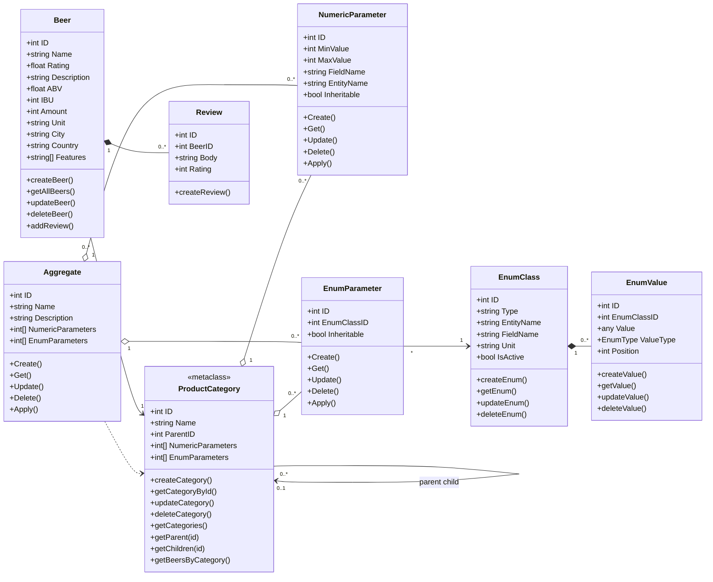

```mermaid
classDiagram
    direction LR
    
    class Aggregate {
        +int ID
        +string Name
        +string Description
        +int[] NumericParameters
        +int[] EnumParameters
        +Create()
        +Get()
        +Update()
        +Delete()
        +Apply()
    }

    class NumericParameter {
        +int ID
        +int MinValue
        +int MaxValue
        +string FieldName
        +string EntityName
        +bool Inheritable
        +Create()
        +Get()
        +Update()
        +Delete()
        +Apply()
    }

    class EnumParameter {
        +int ID
        +int EnumClassID
        +bool Inheritable
        +Create()
        +Get()
        +Update()
        +Delete()
        +Apply()
    }

    class EnumClass {
        +int ID
        +string Type
        +string EntityName
        +string FieldName
        +string Unit
        +bool IsActive
        +createEnum()
        +getEnum()
        +updateEnum()
        +deleteEnum()
    }

    class EnumValue {
        +int ID
        +int EnumClassID
        +any Value
        +EnumType ValueType
        +int Position
        +createValue()
        +getValue()
        +updateValue()
        +deleteValue()
    }

    class Beer {
        +int ID
        +string Name
        +float Rating
        +string Description
        +float ABV
        +int IBU
        +int Amount
        +string Unit
        +string City
        +string Country
        +string[] Features

        +createBeer()
        +getAllBeers()
        +updateBeer()
        +deleteBeer()
        +addReview()
    }

    class ProductCategory {
        <<metaclass>>
        +int ID
        +string Name
        +int ParentID
        +int[] NumericParameters
        +int[] EnumParameters

        +createCategory()
        +getCategoryById()
        +updateCategory()
        +deleteCategory()
        +getCategories()
        +getParent(id)
        +getChildren(id)
        +getBeersByCategory()
    }

    class Review {
        +int ID
        +int BeerID
        +string Body
        +int Rating

        +createReview()
    }

    EnumClass "1" *-- "0..*" EnumValue
    EnumParameter "*" --> "1" EnumClass
    ProductCategory "1" o-- "0..*" NumericParameter
    ProductCategory "1" o-- "0..*" EnumParameter
    Aggregate ..> ProductCategory
    Aggregate "1" o-- "0..*" NumericParameter
    Aggregate "1" o-- "0..*" EnumParameter
    Beer "0..*" --> "1" ProductCategory
    ProductCategory "0..1" <-- "0..*" ProductCategory : parent child
    Beer "1" *-- "0..*" Review
```